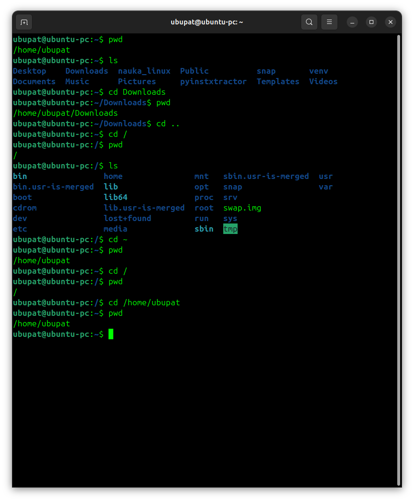

# Day 1 - Practice

## Screenshot

Below are examples of basic navigation commands using `pwd`, `ls`, and `cd`.



## Navigation practice

Today I practiced basic navigation commands in the Linux terminal.

## Commands used

```bash
pwd       # show current directory
ls        # list files
cd /      # go to root directory
cd ~      # go to home directory
ls -la    # show detailed list
```
