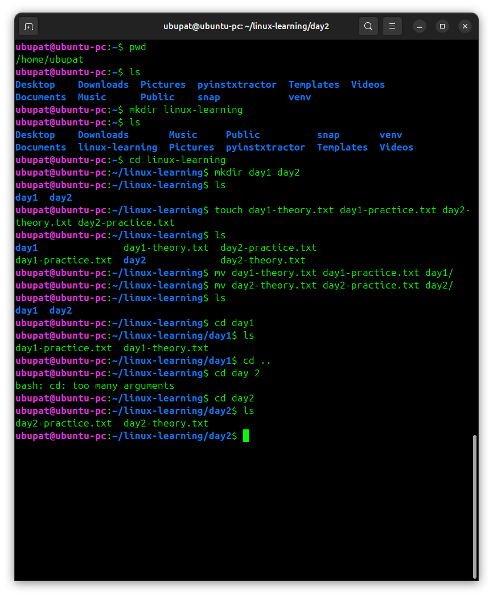
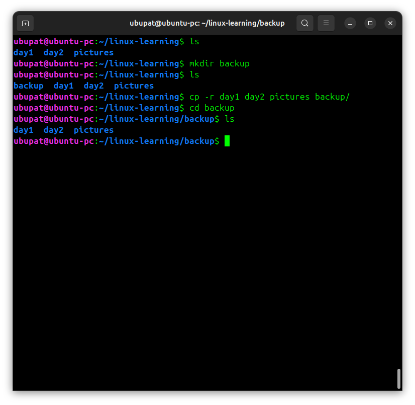
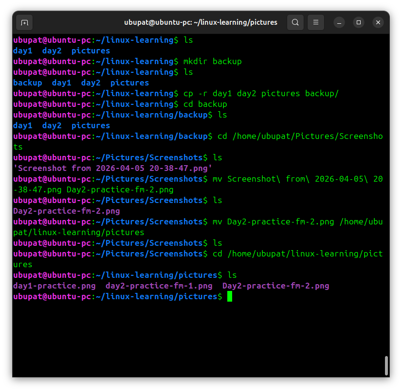

# Day 2 - Practice





## File management practice

Today I practiced creating, moving, copying, and organizing files and directories in Linux.

## What I did

- created directories for learning (`day1`, `day2`)
- created multiple files using one command
- moved files into specific directories
- copied directories using recursive option
- created a backup directory
- worked with file paths
- renamed files with complex names

## Commands used

```bash
mkdir day1 day2                    # create multiple directories
touch file1 file2 file3 file4     # create multiple files

mv file1 file2 day1/              # move files to directory
mv file3 file4 day2/              # move files to another directory

cp -r day1 day2 pictures backup/  # copy directories recursively

cd day1                           # go to directory
cd ..                             # go back
cd day2                           # go to another directory

mv old_name.png new_name.png      # rename file
mv file.png /path/to/directory    # move file to another location

ls                                # list files
