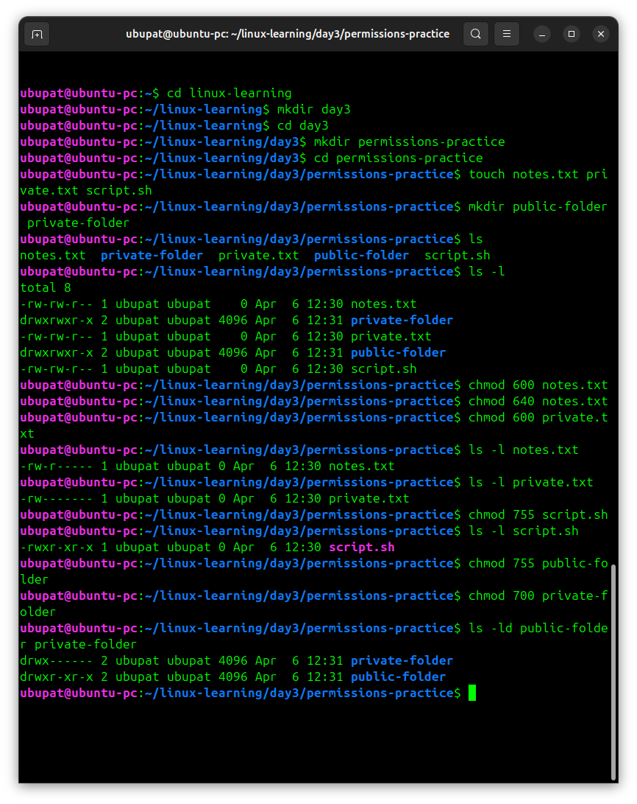
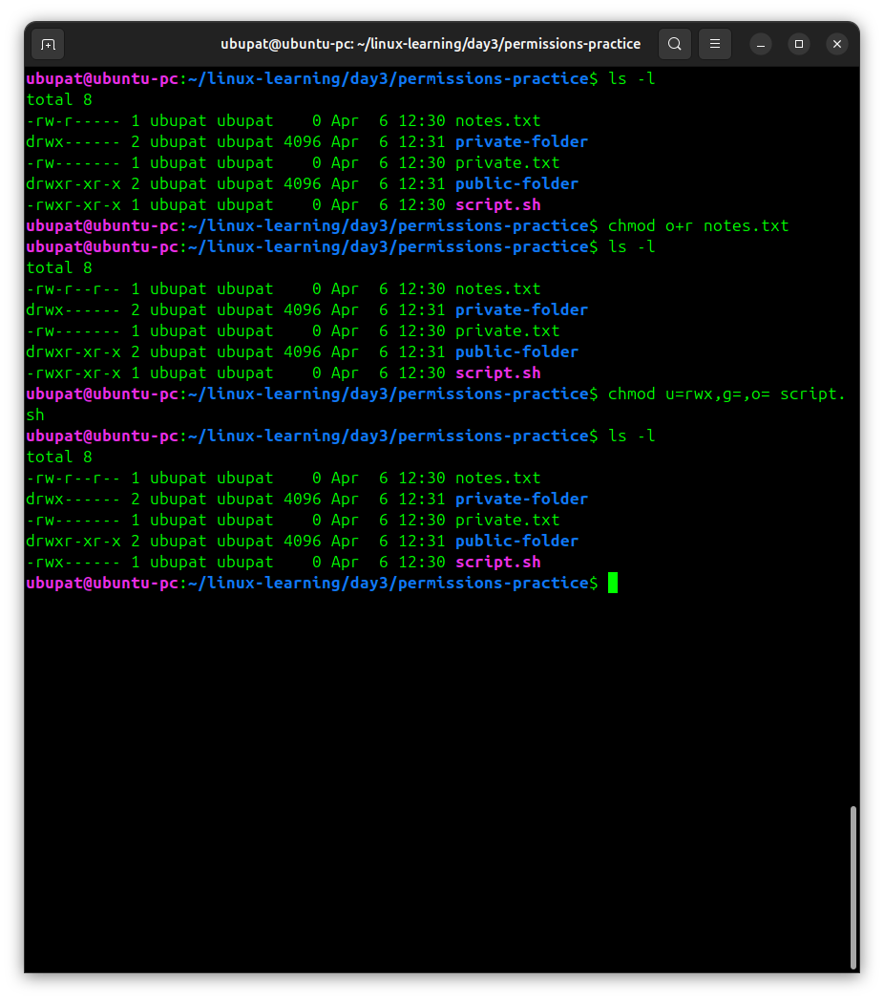

# Day 3 - Practice

## Screenshots

Below are examples of checking and changing permissions using `ls -l` and `chmod`.




## Linux permissions practice

Today I practiced checking and changing file and directory permissions in Linux.

## What I did

- created files and directories for permission testing
- checked permissions with ls -l
- changed permissions using chmod
- used numeric permissions (600, 755, 700)
- used symbolic mode (o+r, u=rwx,g=,o=)
- tested file vs directory permissions


## Commands used

```bash
cd linux-learning/day3
mkdir permissions-practice
cd permissions-practice

touch notes.txt private.txt script.sh
mkdir public-folder private-folder

ls -l                                # show permissions

chmod 600 private.txt                # private file
chmod 755 script.sh                  # executable script

chmod 755 public-folder              # public directory
chmod 700 private-folder             # private directory

chmod o+r notes.txt                  # add read for others
chmod u=rwx,g=,o= script.sh          # owner only access
```
