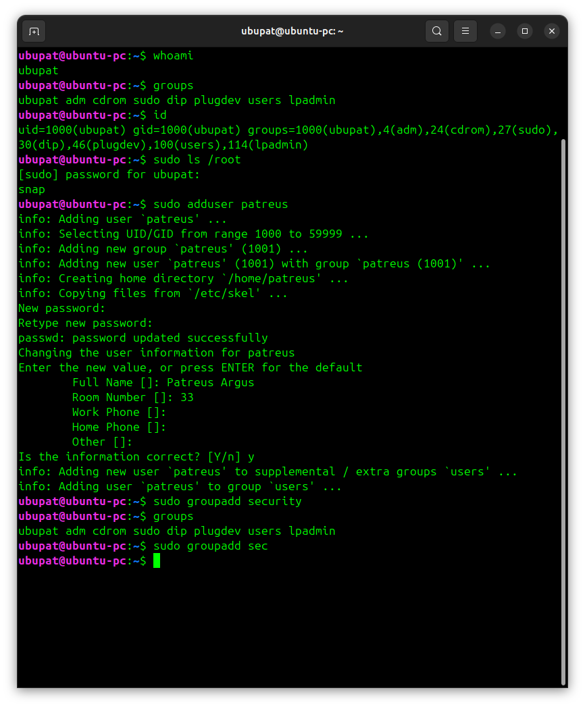
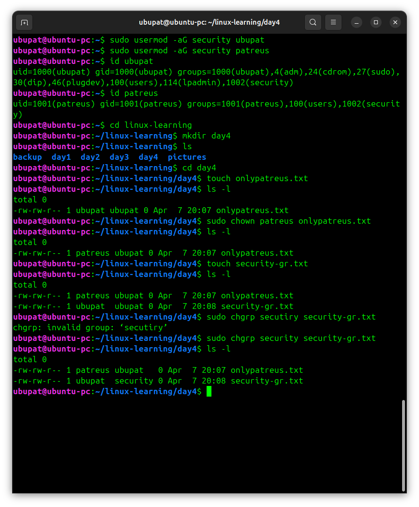

# Day 4 - Practice

## Screenshots

Below are examples of working with users, groups, and file ownership in Linux.




## What I did

- checked current user and groups  
- created a new user and groups  
- added users to a group  
- verified group membership  
- created test files  
- changed file owner and group  

## Commands used

```bash
whoami
id
sudo adduser patreus
sudo groupadd security
sudo usermod -aG security ubupat
sudo chown patreus onlypatreus.txt
sudo chgrp security security-gr.txt
```
