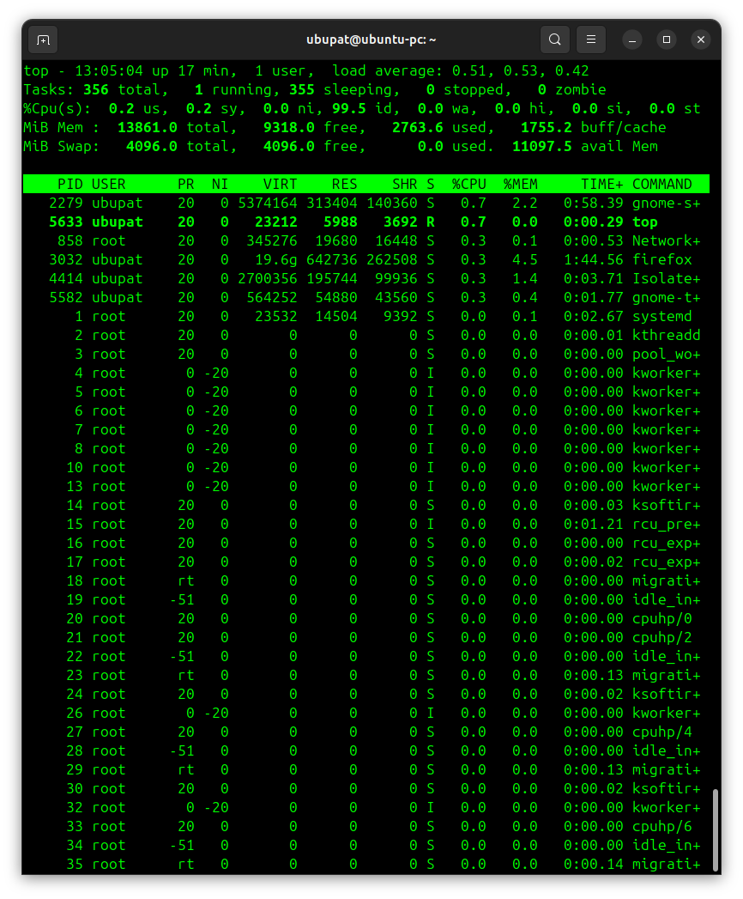
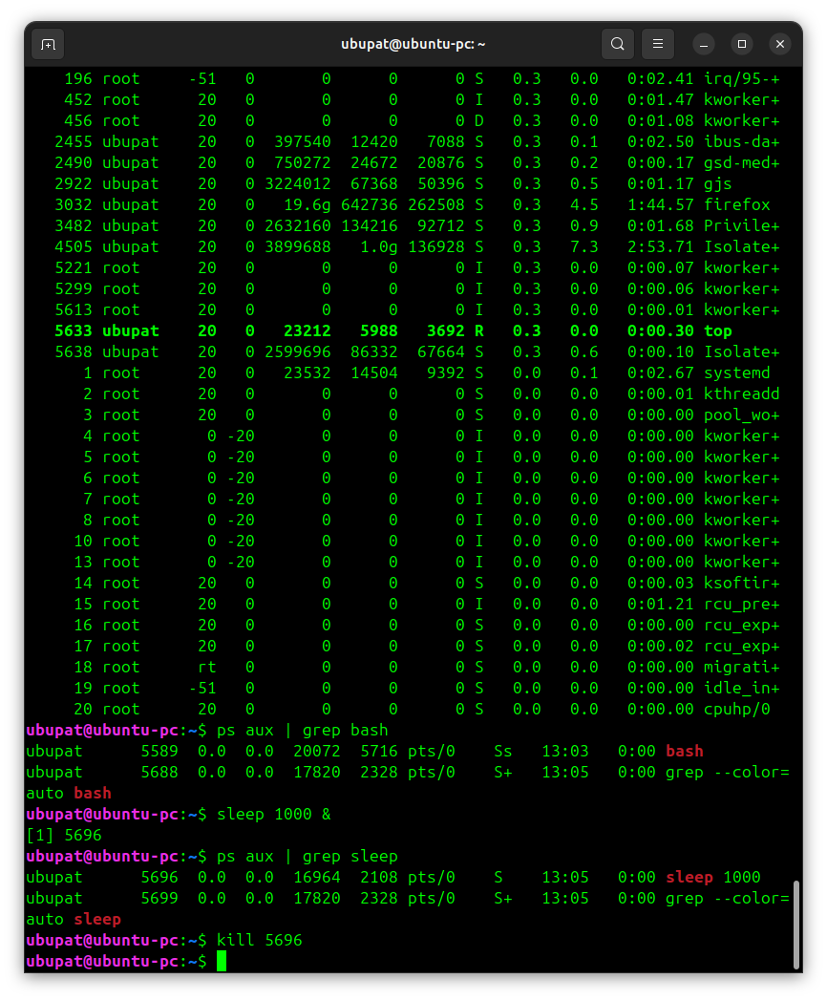

# Day 5 - Practice

Below are examples of working with processes in Linux.



Today I practiced working with processes in Linux.
---
Commands:
```bash
ps  # used to check running processes
ps aux  # showed all processes in the system
```
---
## Monitoring processes

Command:
```bash
top   # monitored CPU and memory usage observed processes in real time
```
---
## Creating a test process

Command:
```bash
sleep 1000 &  # created a process for testing in the background
```
---
## Process ID (PID)

Each process has a unique ID called PID.
Example:
```bash
ps aux | grep sleep  # used to find the PID of a process
```
---
## Killing processes

Command:
```bash
kill PID
```
---
## Summary

Day 5 practice helped me understand how to view, monitor, and control processes in Linux.
