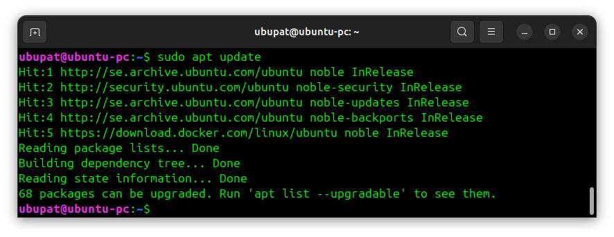
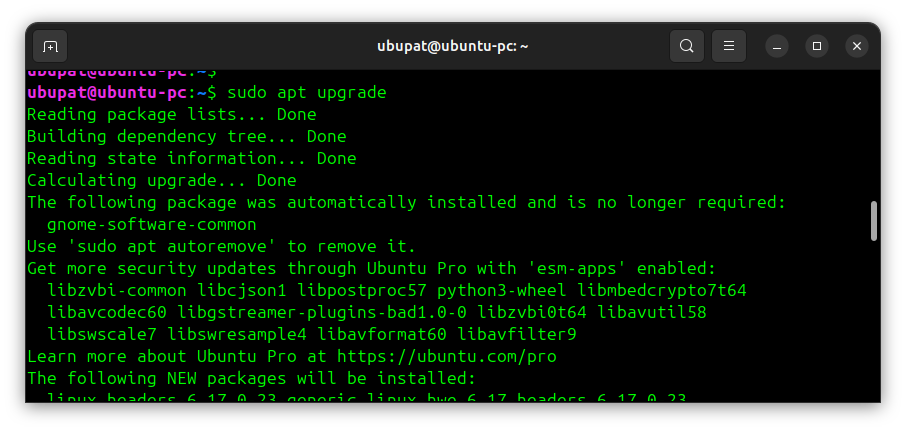
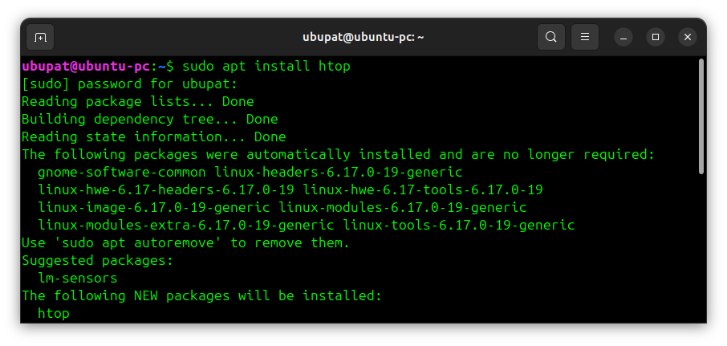
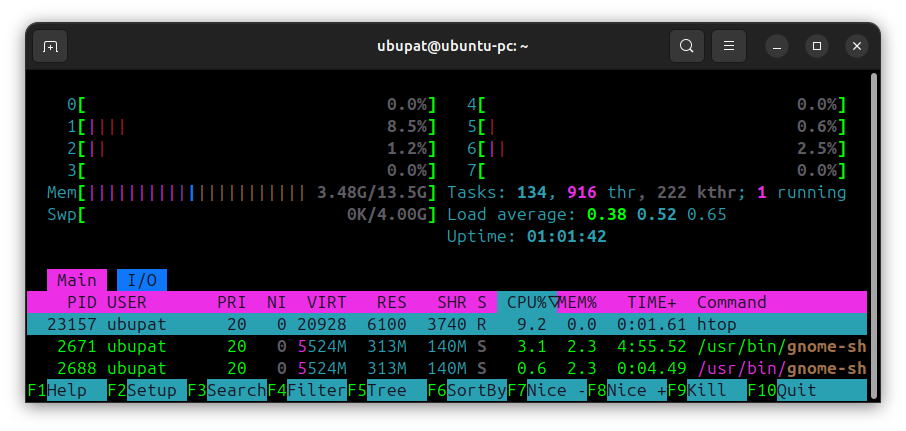
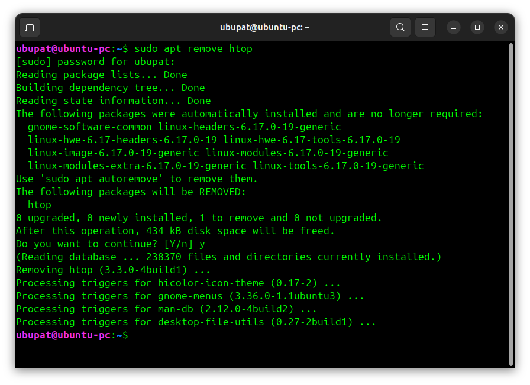
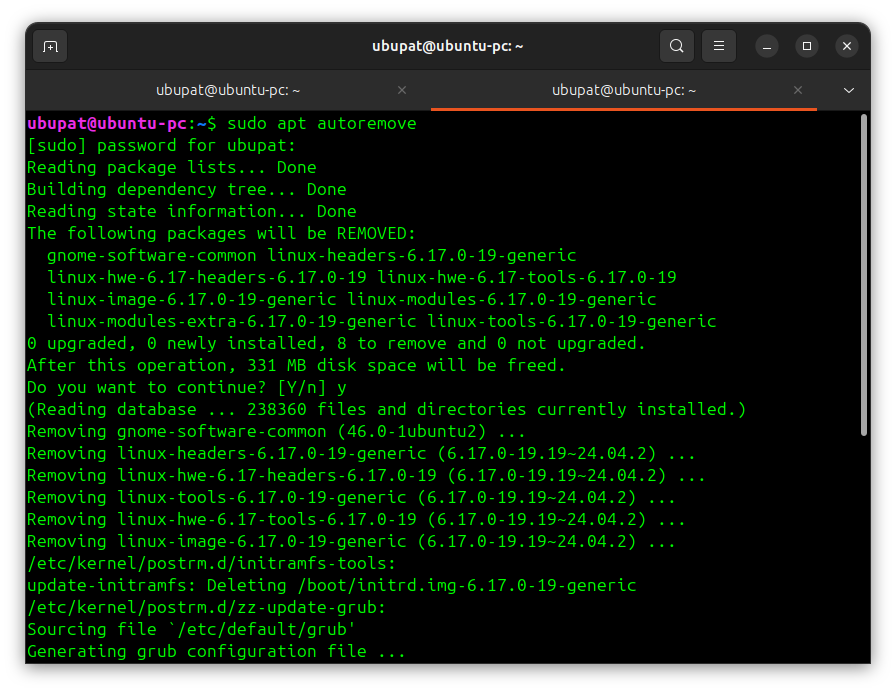

# Day 6 - Practice


## Updating package list

Command:
```bash
sudo apt update  # updated package information
```


------------------------------------------------------------------------

## Upgrading system

Command:
```bash
sudo apt upgrade  # upgraded installed packages
```


------------------------------------------------------------------------

## Installing package

Command:
```bash
sudo apt install htop  # install a htop tool
```


- installed a new tool

------------------------------------------------------------------------

## Running installed program

Command:
```bash
htop  # verified installation
```


------------------------------------------------------------------------

## Searching packages

Command:
```bash
apt search curl
```

- searched for available packages

------------------------------------------------------------------------

## Removing package

Command:
```bash
sudo apt remove htop  # removed installed package
```


------------------------------------------------------------------------

## Cleaning system

Command:
```bash
sudo apt autoremove  # removed unused dependencies
```


------------------------------------------------------------------------

## Summary

Day 6 practice helped me understand how to manage software using APT.
