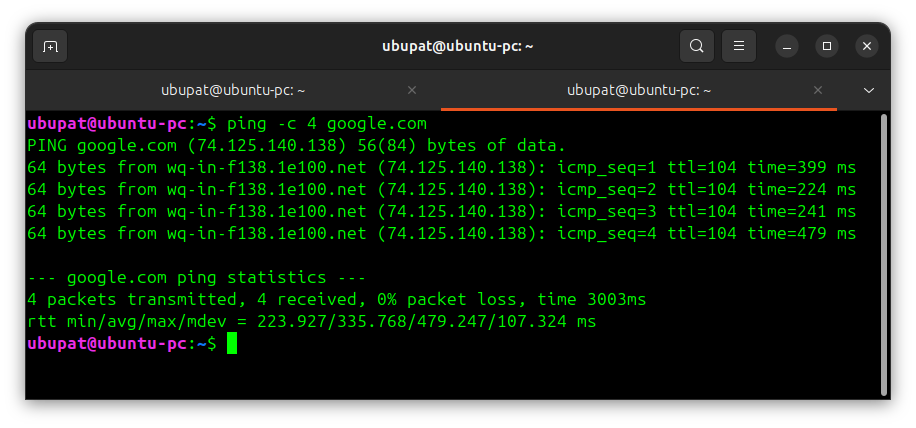
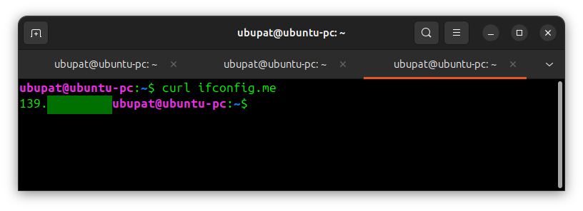
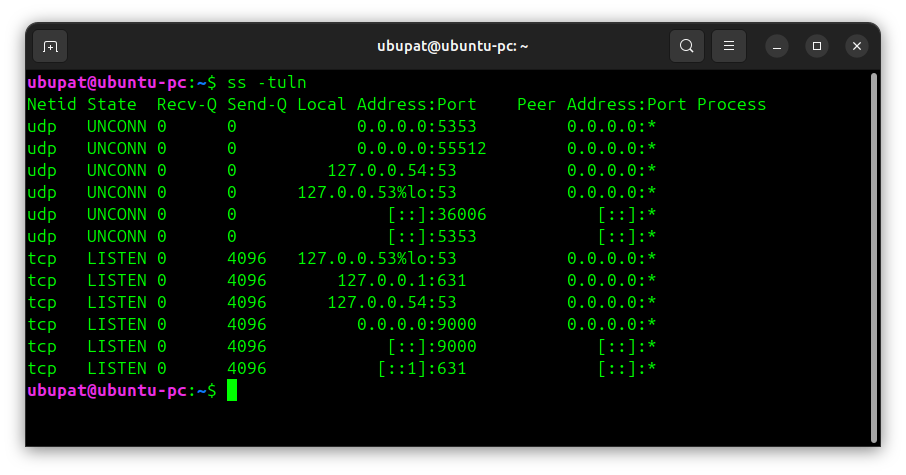

# Day 7 - Practice

## What I did

Today I practiced basic networking commands in Linux.

------------------------------------------------------------------------

## Checking IP address

Command:
```bash
ip a    # show network interfaces and IP addresses
```
![Networking practice]](../images/day7-practice-1.png)

------------------------------------------------------------------------

## Testing connection

Command:
```bash
ping -c 4 google.com    # test connectivity by sending 4 packets
```


------------------------------------------------------------------------

## Using curl

Command:
```bash
curl ifconfig.me    # display public IP address
```


------------------------------------------------------------------------

## Checking ports

Command:
```bash
ss -tuln    # list open ports and listening services
```


------------------------------------------------------------------------

## Summary

Day 7 practice helped me understand basic networking commands and diagnostics.
